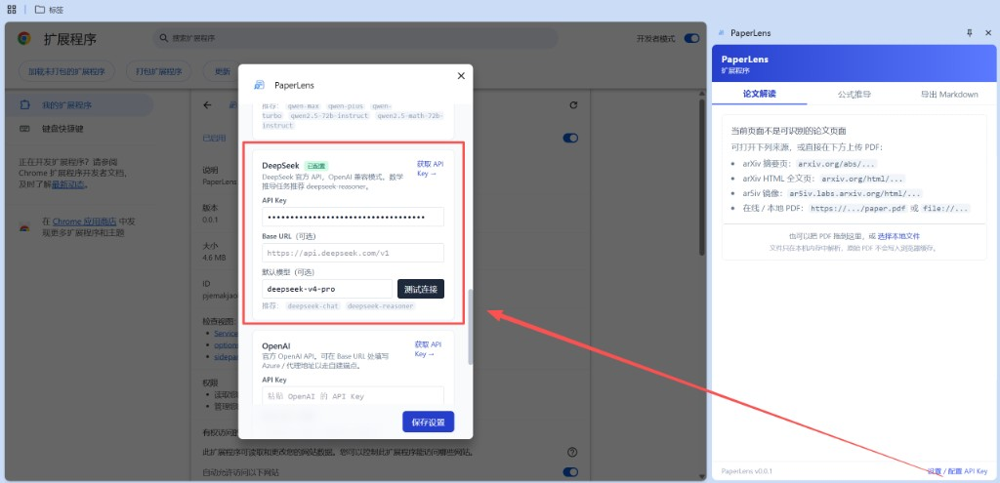
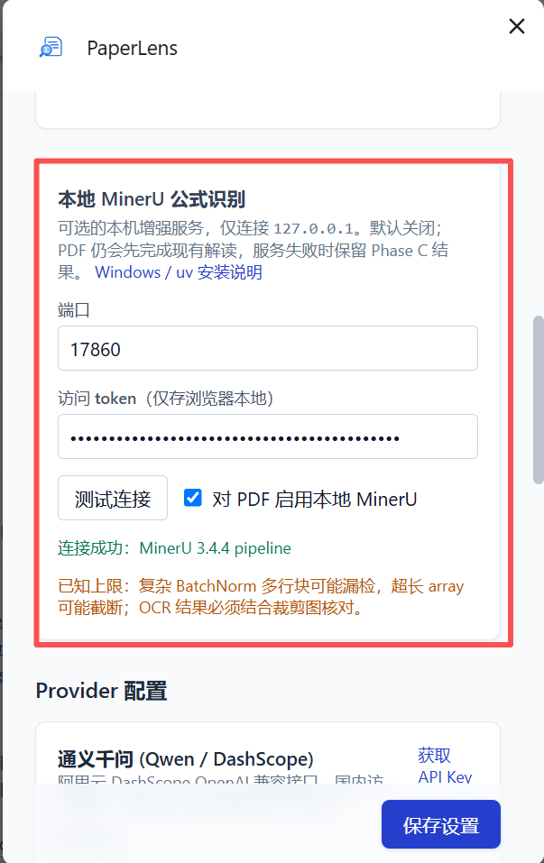
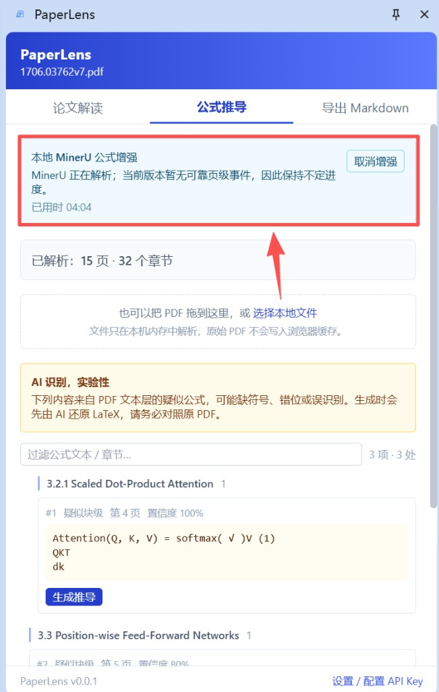
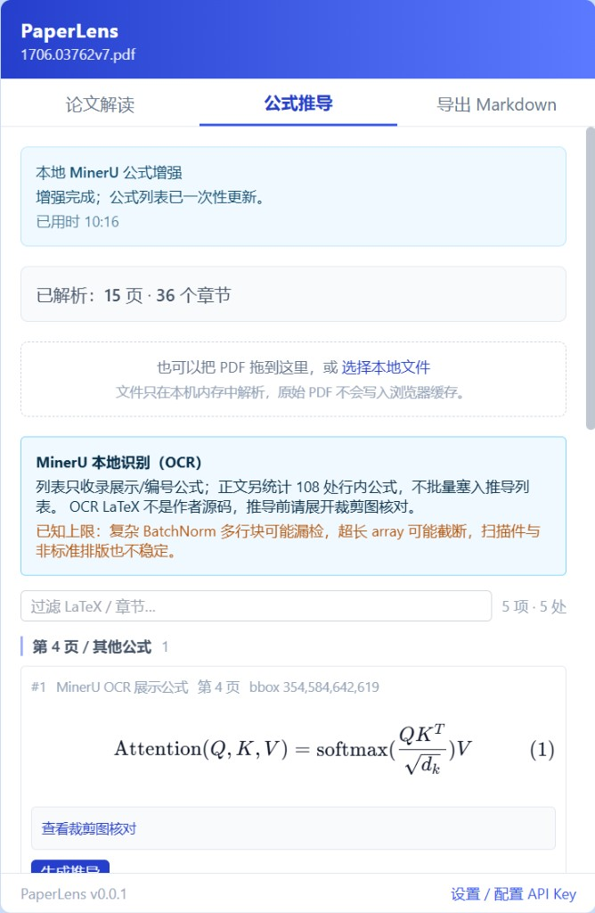
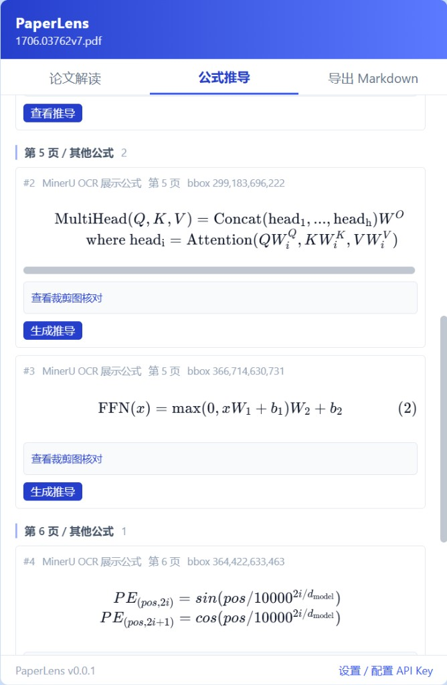

# PaperLens

一款面向论文精读的 Chrome 扩展：支持 arXiv 页面、在线/本地 PDF 与文件上传，一键生成**论文解读**、**公式逐步推导**，并**导出为 Markdown** 文件。

## 特性

- **多来源抽取**：支持 arXiv 摘要页（`/abs`）、HTML 全文（`/html`）、ar5iv 镜像，以及 arXiv、任意在线和本地 `file://` PDF；也可直接选择或拖入 PDF 文件。PDF 场景下原文仍显示在标签页、解析结果在侧边栏，**边看边读**。
- **PDF 本地解析**：pdf.js Worker 在扩展内解析文本层，支持单双栏阅读顺序、页眉页脚清理、断词/段落重建、标题/作者/参考文献识别和逐页进度；原始 PDF 二进制不写入浏览器缓存。
- **论文解读**：结构化总结研究问题 / 方法 / 主要贡献 / 实验与结果 / 结论；长论文自动 Map-Reduce 压缩，支持简洁 / 详细两档粒度。
- **公式逐步推导**：网页真 LaTeX 支持回跳原文；PDF 无本地服务时使用 Phase C 实验性候选，并提示先还原、核对再推导。
- **MinerU PDF 公式增强**：推荐为 PDF 启用只连接 `127.0.0.1` 的 MinerU 3.4.4 本地服务，获得展示公式、page+bbox、按需裁剪核对和行内公式统计；失败或取消时确定性保留 Phase C 结果。
- **Markdown 导出**：一键保存为 `.md` 文件，含 YAML front-matter（适合 Obsidian / Typora），公式保留 `$$...$$` 语法。
- **BYOK（Bring Your Own Key）**：支持 **Qwen（DashScope 兼容模式）/ DeepSeek / OpenAI / Anthropic** 四家 LLM，API Key 仅存本地；支持为"解读 / 推导"分别绑定不同模型（例如推导用 `deepseek-reasoner`）。
- **流式渲染**：所有 LLM 调用走 SSE 流式，SidePanel 边生成边显示。
- **公式渲染**：KaTeX 完整离线字体打包，不依赖外网 CDN。

## 技术栈

- [WXT](https://wxt.dev/) + React 19 + TypeScript
- Tailwind CSS v3
- Chrome Manifest V3（SidePanel API）
- Markdown：`marked` + `DOMPurify`
- 公式：`katex`
- PDF 解析：`pdfjs-dist`（在 SidePanel 内本地解析，Worker 独立懒加载）
- PDF 本地公式增强：Python 3.12 + MinerU 3.4.4 pipeline（独立 localhost 薄服务）
- 可选后续：`tiktoken`（更精确的 token 计数）

## 快速开始

### 加载扩展并完成首次使用

1. 找到已经构建好的 `.output/chrome-mv3/` 目录
2. 打开 Chrome → `chrome://extensions`
3. 右上角开启「开发者模式」
4. 点击「加载已解压的扩展程序」，选择 `.output/chrome-mv3/` 目录
5. 打开任一论文来源，例如：
   - 摘要页：<https://arxiv.org/abs/2310.06825>
   - HTML 全文：<https://arxiv.org/html/2310.06825>
   - ar5iv：<https://ar5iv.labs.arxiv.org/html/2310.06825>
   - PDF：<https://arxiv.org/pdf/2310.06825>（在 PDF 标签页点「解析本页 PDF」，可边看 PDF 边读解读）
   - 其他在线 PDF：首次解析时仅申请当前站点权限
   - 本地 `file://` PDF：需在扩展详情开启「允许访问文件网址」
6. 点击工具栏的 PaperLens 图标 → SidePanel 打开
7. 首次使用先点击 SidePanel 底部「设置 / 配置 API Key」，配置至少一家 LLM（例如
   DeepSeek）→「测试连接」→ 连接成功后「保存设置」
8. 网页来源点击「抽取本页」；PDF 点击「解析本页 PDF」，也可在 SidePanel 中选择或
   拖入本地 PDF
9. 在「论文解读」Tab 选择粒度并生成解读；在「公式推导」Tab 选择公式并生成推导
10. 在「导出 Markdown」Tab 预览并保存 `.md`



*图 1：从侧栏底部进入设置；示例中 DeepSeek 已配置，可先测试连接再保存。API Key
仅保存在浏览器本地，不要提交或公开。*

完成以上普通使用流程后，如果希望获得更可靠的 PDF 展示公式、页码/bbox 和裁剪核对，
再继续阅读下方「启用本地 MinerU 公式识别」。

## 启用本地 MinerU 公式识别（推荐用于 PDF）

MinerU 公式增强默认关闭；未启用时，PDF 仍可完成正文解析、论文解读和 Phase C
实验性公式候选。加载 `.output/chrome-mv3` 只安装了浏览器扩展，**不会同时安装或启动
MinerU 服务**。

**前置条件 / 耗时说明**

- 必须先安装 `uv`；可用 `uv --version` 检查。缺少 uv 时安装脚本会失败，安装说明见
  [`services/mineru/README.md`](./services/mineru/README.md)。
- `install-windows.ps1` 是一次性的重安装步骤，会准备隔离 Python 3.12 和 MinerU
  依赖；它与日常“启动服务”不是同一件事。
- `manage-windows-task.ps1 -Action Run` 只适用于已经安装好的 runtime；尚未安装时不要
  跳过安装直接运行该命令。
- 安装完成后，服务启动通常需要十几秒；首次真正解析 PDF 时还可能下载、载入模型，
  需要再等待数分钟。

以下首次流程适用于 Windows。使用普通 PowerShell 即可，不需要管理员权限。第 1 步使用
仓库相对路径，需在 PaperLens 仓库根目录执行；安装完成后的命令使用
`%LOCALAPPDATA%` 绝对路径，可在任意目录的 PowerShell 执行。

### 1. 安装本地服务（只需一次）

在 PaperLens 仓库根目录打开 PowerShell，然后执行：

```powershell
powershell.exe -NoProfile -ExecutionPolicy Bypass `
  -File services/mineru/scripts/install-windows.ps1
```

安装器使用隔离的 Python 3.12，不修改全局 Anaconda/CUDA。首次安装会创建本机配置、
注册当前用户登录任务并安装 MinerU 依赖，耗时和磁盘占用取决于网络与缓存。

### 2. 立即启动服务

登录任务会在以后登录 Windows 时自动启动服务。刚安装完成时可立即运行：

```powershell
$runtime = "$env:LOCALAPPDATA\PaperLens\MinerU\runtime"
powershell.exe -NoProfile -ExecutionPolicy Bypass `
  -File "$runtime\maintenance\manage-windows-task.ps1" `
  -Action Run
```

`TASK_READY` 只表示登录任务配置正确，**不等于服务已运行**。看到 `TASK_STARTED` 后
等待十几秒，再进行 health 检查。

### 3. 确认 health 就绪

```powershell
Invoke-RestMethod "http://127.0.0.1:17860/v1/health" |
  ConvertTo-Json -Depth 6
```

期望返回 `"status": "ready"`、`"serviceVersion": "0.1.0"`，以及
MinerU `3.4.4` / `pipeline`。若暂时连接失败，等待几秒后重试。

### 4. 取得本机 token

```powershell
notepad.exe "$env:LOCALAPPDATA\PaperLens\MinerU\paperlens-mineru.toml"
```

在 `[auth]` 下复制 `token = "..."` 引号内的值。token 只应粘贴到本机 PaperLens
设置，不要发到聊天、截图、Issue 或提交到 Git。

### 5. 在扩展中连接

打开 PaperLens 设置页，端口填写 `17860`，粘贴 token，依次点击「测试连接」、
勾选「对 PDF 启用本地 MinerU」，最后点击「保存设置」。连接成功时会显示
`MinerU 3.4.4 pipeline`。



*图 2：端口、token 和启用开关配置完成，测试连接成功。*

### 6. 打开 PDF 使用公式增强

打开在线、本地或上传的 PDF，在「公式推导」Tab 触发解析。PaperLens 会先用 pdf.js
完成正文与 Phase C 基线，再启动 MinerU 增强；增强可取消，连接失败、取消、超时或
结果校验失败时仍保留 Phase C，不会清空论文内容。



*图 3：MinerU 正在增强。当前 MinerU 没有可信页级事件，因此显示不定进度和已耗时
属于正常限制，不代表卡死；可随时取消。*



*图 4：增强完成后切换为 MinerU OCR 公式，可按 page+bbox 查看裁剪图核对。*



*图 5：Attention、MultiHead、FFN 等展示公式按页进入列表；行内公式只统计，不批量
塞入推导列表。*

安装器注册的是当前用户登录自启任务，不是需要管理员权限的 Windows SCM 服务。
本地服务通过固定 GitHub Releases `mineru-v*` 稳定通道自动或手动检查更新；该通道
**只更新 MinerU 薄服务，不更新 Chrome 扩展本体**。卸载、doctor、手动检查更新、
故障恢复与发布资产契约见 [`services/mineru/README.md`](./services/mineru/README.md)。

## 开发与构建

### 环境要求

- Node.js ≥ 18（建议 22+）
- pnpm 10+

### 常用命令

```bash
pnpm install          # 安装依赖（会触发 wxt prepare）
pnpm dev              # 开发模式，自动打开 Chrome 并加载扩展（HMR）
pnpm build            # 生产构建，产物在 .output/chrome-mv3/
pnpm compile          # 仅做 tsc 类型检查（不产出）
pnpm test:pdf         # PDF 单元/功能回归
pnpm test:phase-c:browser # 真实 PDF + 扩展 UI 冒烟（需本机 Chrome/Edge）
pnpm test:mineru:client   # MinerU client/provider 契约与回退
pnpm test:mineru:browser  # 真实本地 MinerU 浏览器闭环（需先启动服务）
pnpm zip              # 打 zip 包以上架 Chrome Web Store
```

## 目录结构

```
.
├── entrypoints/                     # WXT 入口（扩展各组件）
│   ├── background.ts                # Service Worker：LLM Port 路由 + 生命周期
│   ├── content.ts                   # Content Script：arXiv 页抽取 + 回跳滚动
│   ├── sidepanel/                   # SidePanel UI（React）
│   │   ├── App.tsx
│   │   ├── tabs/
│   │   │   ├── SummaryTab.tsx       # 论文解读 Tab（流式）
│   │   │   ├── DerivationTab.tsx    # 公式推导 Tab（列表 + 详情）
│   │   │   └── ExportTab.tsx        # 导出 Tab（预览 + 下载）
│   │   └── style.css
│   └── options/                     # BYOK 设置页
│       ├── Options.tsx
│       └── ...
├── src/                             # 业务代码
│   ├── extractors/                  # arXiv 页面抽取（abs / latexml）
│   ├── pdf/                         # PDF 解析（pdf.js 懒加载 + 版面重建 → PaperContent）
│   ├── mineru/                      # localhost client、schema 校验与设置契约
│   ├── formula/                     # <math> 抽取 + Markdown ↔ KaTeX 桥
│   ├── llm/                         # LLM Provider 抽象与实现
│   │   ├── providers/
│   │   │   ├── qwen.ts
│   │   │   ├── deepseek.ts
│   │   │   ├── openai.ts
│   │   │   ├── anthropic.ts
│   │   │   └── openaiCompatible.ts
│   │   ├── protocol.ts              # SidePanel ↔ Background 的 Port 协议
│   │   ├── bgHandler.ts             # Service Worker 侧 LLM 流转
│   │   ├── retry.ts                 # 429/5xx 自动重试（仅首次响应前）
│   │   └── sse.ts                   # SSE 行迭代器
│   ├── bridge/                      # SidePanel → Content / Background 桥
│   ├── pipelines/                   # summarize / derive 流水线
│   ├── prompts/                     # Prompt 模板
│   ├── storage/                     # chrome.storage 封装 + 任务绑定
│   ├── export/                      # Markdown 模板 + 下载封装
│   ├── components/                  # 通用 UI 组件（MarkdownView）
│   └── util/                        # 通用工具（token 估计等）
├── docs/                            # 开发笔记
├── services/mineru/                 # Python 3.12 + MinerU 3.4.4 本地薄服务
├── wxt.config.ts
├── tailwind.config.js
├── postcss.config.js
└── tsconfig.json
```

## 里程碑

- [x] M0 环境搭建（WXT + React + TS + Tailwind，空侧边栏在 arXiv 页弹出）
- [x] M1 arXiv 抽取器（abs / html / ar5iv 三种页面统一结构化输出）
- [x] M2 BYOK + LLM Provider（Qwen / DeepSeek / OpenAI / Anthropic）+ Options 页
- [x] M3 论文解读全链路（Map-Reduce、结构化 Markdown、SidePanel 流式）
- [x] M4 公式逐步推导（公式列表 + 推导 Prompt + KaTeX 渲染 + 锚点回跳）
- [x] M5 Markdown 导出（YAML front-matter + `chrome.downloads`）
- [x] M6 打磨（错误处理、429/5xx 重试、空态、README）
- [x] M7 沉淀 Cursor Skill：`browser-extension-dev`（已随仓库分享，见 [`.cursor/skills/`](./.cursor/skills/)）+ `git-push-flow`（个人全局，未入库）
- [x] M8 arXiv PDF 解析（甜点场景）：在 `/pdf/` 页 fetch 字节 + pdf.js 本地解析 → 论文解读 / 导出打通（详见 [`docs/plan-pdf-extraction.md`](./docs/plan-pdf-extraction.md)）
- [x] M9 PDF Phase B：任意在线/本地/上传摄入，单双栏版面与结构增强，逐页进度及浏览器关键路径验收
- [x] M10 PDF Phase C：疑似公式候选、AI 先还原再推导、实验性标识与页码定位
- [x] M11 MinerU 薄集成 Epic A/B：安全本地服务、事务回退、真实进度/取消、展示公式与裁剪核对
- [x] M12 MinerU Epic C：Windows 安装/重装/卸载、登录自启、GitHub Releases 稳定更新；`mineru-v0.1.0` 已发布，本机安装、health、稳定通道检查与扩展连接冒烟通过

### 待办（欢迎 PR）

- **PDF 公式质量调优**：扩充代表论文样本；后续更高 `mineru-v*` 的真实下载升级，以及取消/超时/TTL 后裁剪失效的发布级浏览器矩阵仍可继续补强。
- **KaTeX 字体瘦身**：默认打包了 Main/AMS/Caligraphic/Fraktur 等全部字形，可按需剔除仅保留 Main+AMS。
- **多论文对比**：目前只解读"当前活动 Tab"，后续可以沉淀历史。

## 隐私

- 所有 LLM API Key 仅存于 `chrome.storage.local`，只在扩展的 Service Worker 中使用，不随任何页面注入。
- 没有任何遥测或云端同步，导出和解读均为本地操作。
- arXiv / ar5iv 使用固定白名单；其他在线 PDF 只在点击解析时申请当前 origin 权限，本地 `file://` 访问由浏览器扩展详情开关控制。
- 上传 PDF 仅在本机内存中解析，缓存只保存结构化结果和内容摘要键，不保存原始二进制。
- MinerU 服务只连接 `127.0.0.1`；token 仅存 `chrome.storage.local`。服务端输入 PDF 在任务终态删除，结构化结果/裁剪图默认 24 小时 TTL，模型与本地任务产物不进入 Git。
- 发往 LLM 的是论文的**结构化文本**（不含完整 PDF），且只在你显式点击「生成解读 / 生成推导 / 测试连接」时发送。

## 许可

MIT
